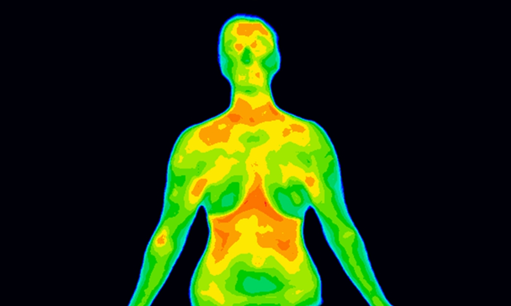

# 🌡️ Thermal Fever Detection using Thermal Image Processing

This Python application allows users to upload a thermal-style image, automatically detect potential fever signs using color analysis and face detection, and estimate body temperature visually. The tool uses OpenCV and a GUI built with Tkinter.

---

## 🛠 Features

- Upload thermal-style images (JPG, PNG).
- Detect face and thermal regions automatically.
- Estimate body temperature from pixel intensity.
- Mark fever zones if temperature exceeds 38°C.
- Draw a vertical temperature color scale (36°C–40°C).
- Save processed results.

---

## 🖥 Demo Screenshot



---

## 📦 Requirements

Install required packages using:

```bash
pip install -r requirements.txt
